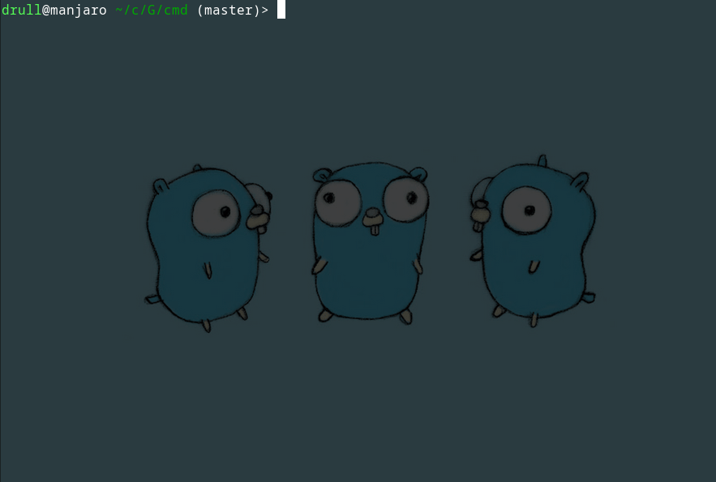
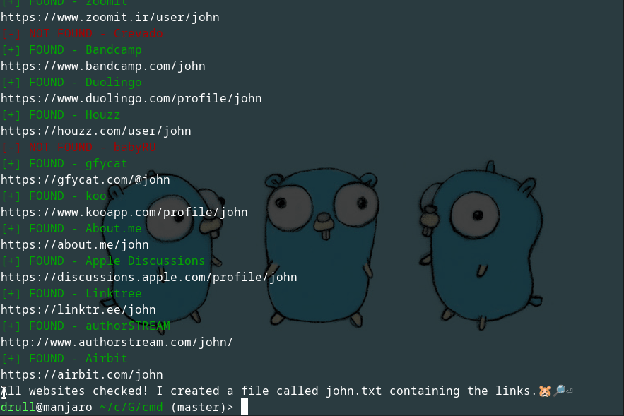

# Gopher Find 🐹🔎 - Work in progress

Gopher Find is a blazingly fast alternative to [Sherlock](https://github.com/sherlock-project/sherlock) written in [Go](https://go.dev/).

This project is still under development and new features will be added soon.

All the websites Gopher Find look for were extracted from the Sherlock project.

## Known issues

- Some websites return false positives. This is caused because Gopher Find uses status codes to determine if a username is valid or not. In the future, support for error messages in the page will be added.

## Contributing

Feel free to fork the project, make changes and open pull requests. Any contribution is welcome.
